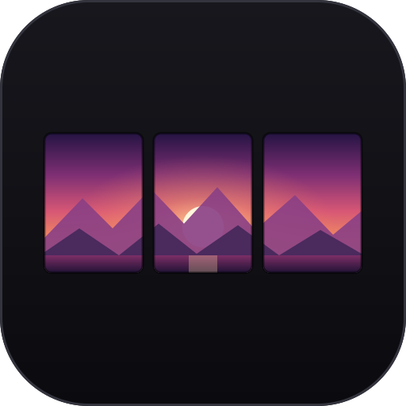
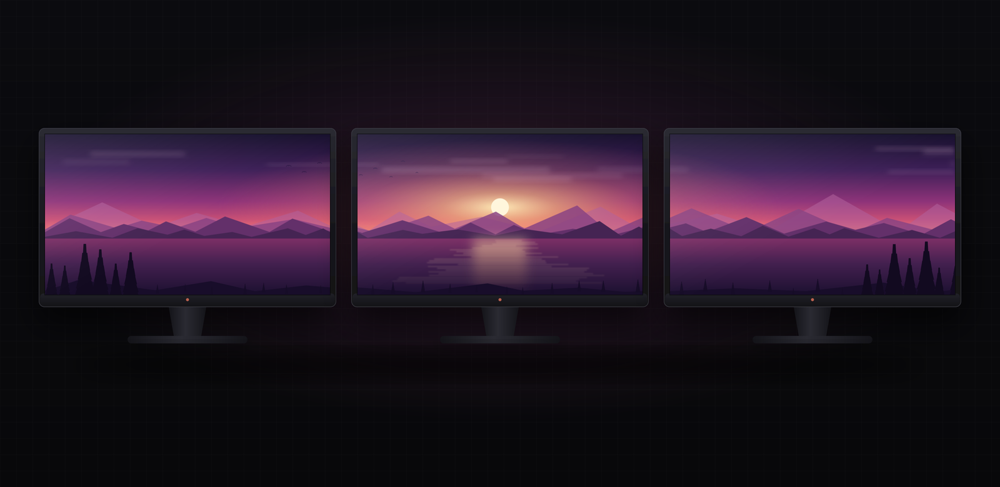

<div align="center">



# Horizon

**One image, continuously, across the monitors you choose.**

[](https://omarchy.org)
[](https://plugins.omarchy.org/plugin.html?id=kudos.span-wallpaper)
[](LICENSE)

</div>



Omarchy paints the same wallpaper on every display. Horizon builds a single
virtual canvas from the monitors you select, cuts the image at each display edge,
and gives every output the part that belongs at its real Hyprland position.
Monitors you leave out keep the normal Omarchy theme wallpaper.

The plugin id stays `kudos.span-wallpaper`, so every command below is unchanged.

## Features

- Visual monitor picker drawn from the live Hyprland layout
- Any combination of connected monitors can form the canvas
- Three scaling modes: **Fill**, **Show whole**, and **Stretch**
- One-click access from an Omarchy bar widget
- Automatic recropping when the monitor layout changes
- Source image and selection persist across shell restarts
- Coexists with Omarchy theme changes and wallpaper cycling
- Supervised out-of-process GTK file chooser, keeping portal failures outside Quickshell

## Requirements

- Omarchy Quattro with third-party shell plugin support
- ImageMagick (`imagemagick`)
- Python 3 and GObject bindings with GTK 4 (`python`, `python-gobject`, `gtk4`)
- util-linux (`prlimit`, included with Omarchy)

The plugin uses the system executables under `/usr/bin` and the plugin installer
does not install these dependencies. Run this once in a terminal before enabling
the plugin (Omarchy installs only missing packages):

```sh
omarchy pkg add imagemagick python python-gobject gtk4 util-linux
```

## Install

```sh
omarchy plugin add https://github.com/owainharris/omarchy-horizon.git --enable
```

The widget defaults to the right side of the bar. To place it immediately before
the power button:

```sh
omarchy bar put kudos.span-wallpaper --section right --before omarchy.power
```

Update to the latest commit later with:

```sh
omarchy plugin update kudos.span-wallpaper
```

## Usage

Click the image icon in the bar, or open the controls from a terminal:

```sh
omarchy-shell shell summon kudos.span-wallpaper
```

Then:

1. Select the monitor rectangles that should share the wallpaper.
2. Pick an Omarchy background or choose another local image.
3. Select a scaling mode.
4. Click **Apply**.

The scaling modes map the source image onto the bounding rectangle of the
selected monitors:

| Mode | Result |
| --- | --- |
| **Fill** | Preserves the image proportions and crops overflow. |
| **Show whole** | Preserves the image proportions and adds black padding. |
| **Stretch** | Uses the full image and may change its proportions. |

Physical gaps and offsets in the compositor layout remain part of the virtual
canvas, so the visible portions align correctly across display edges. Click
**Clear span** to reveal Omarchy's current theme wallpaper again.

JPEG, PNG, WebP, GIF, and BMP files are supported; animated files use their first
frame. Select the actual image file rather than a symbolic link. Sources are
limited to 256 MiB, and the selected canvas to 40 million pixels. The file chooser
closes after two minutes if no selection is made. With an active span, changing
the scaling mode immediately reapplies it; **Cancel** closes the controls without
undoing an already applied change.

## How it works

Omarchy normally paints the same wallpaper independently on every display.
Horizon instead creates one virtual canvas from the selected monitor geometry,
prepares that image with ImageMagick, and saves one exact crop per output. Lightweight layer-shell windows display those crops above Omarchy's
stock background and below normal application windows.

Generated crops and a retained copy of the selected source are stored in:

```text
~/.local/state/omarchy/span-wallpaper/
```

Keeping the source lets the plugin regenerate crops after a display is plugged
in, removed, moved, or resized. Image processing has bounded input size,
geometry, memory, disk, output, and execution-time limits to protect the
long-running shell from malformed or oversized files.

The large intermediate canvas is written to a random owner-only directory on
`/tmp` and removed after each render. On Omarchy this uses tmpfs, avoiding slow
Btrfs compression and writeback; retained sources, final crops, and state stay
under the state directory above.

## Privacy and permissions

Horizon works locally and makes no network requests. It reads active monitor
geometry and the image you select, runs ImageMagick, and writes generated data to
its state directory and a private temporary work directory. It needs no elevated
permissions at runtime and does not replace Omarchy's built-in background plugin.

Selected images and state are opened as bounded regular files without following
symbolic links. State is published atomically relative to an owner-only state
directory. Helper processes run with a minimal environment, fixed executable
paths, output limits, deadlines, and process-group cancellation. Dynamic file,
monitor, and error strings are rendered as plain text by the QML interface.

Like all Omarchy shell plugins, it runs unsandboxed inside Quickshell. Review
the source before installing third-party plugins.

## Remove

Clear the active span first if you want the normal wallpaper to reappear
immediately, then remove the plugin:

```sh
omarchy-shell kudos.span-wallpaper clear
omarchy plugin remove kudos.span-wallpaper
```

Removing the plugin intentionally leaves its state and retained source image
under `~/.local/state/omarchy/span-wallpaper/`. Delete that directory if you do
not want to keep them:

```sh
rm -rf ~/.local/state/omarchy/span-wallpaper
```

## Development

From an existing checkout with the runtime dependencies, Node.js, and Qt 6 QML
tools installed, validate the plugin with Omarchy and run the complete test
suite:

```sh
./test.sh
```

Install the working tree for local iteration:

```sh
omarchy plugin add "$PWD" --enable
```

The tests validate the manifest, exercise bounded state and image handling,
verify rejection of symbolic links, FIFOs, oversized files and geometry,
confirm deadline/output/process-tree supervision, test monitor geometry and
state parsing, compare real crop pixels in all scaling modes, test clear/cancel
controller behavior, and parse every QML component. QML parsing does not replace
a live shell test; verify the chooser, display hotplug, and wallpaper cycling on
your desktop before releasing changes to those flows.

## License

[MIT](LICENSE). The icon and the preview artwork, including the landscape shown
on the displays, were drawn for this project and are covered by the same license.
